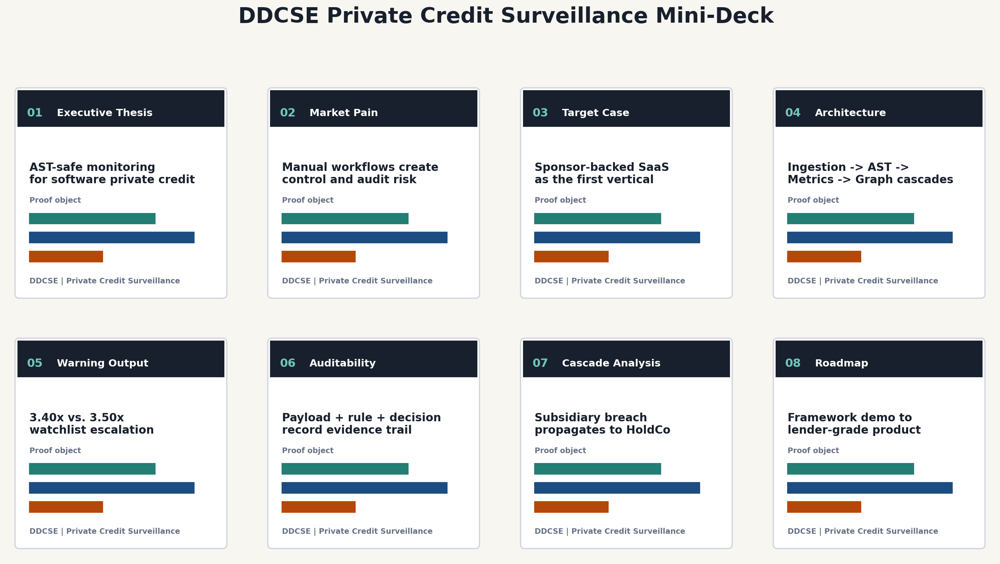

# DDCSE Private Credit Surveillance Mini-Deck

## Positioning

DDCSE is best presented as an institutional surveillance framework for a
sponsor-backed middle-market SaaS/software borrower. The current repository is
a framework demonstration, not a live borrower model. The professional output
therefore uses synthetic borrower data, realistic covenant architecture, and an
optional public-market data ingestion layer to show how the system would work in
a real credit monitoring environment.

## Audience

- Private credit investment teams
- Portfolio monitoring teams
- Corporate banking relationship managers
- Leveraged finance risk teams
- Credit operations and internal audit stakeholders

## Core Thesis

Manual covenant monitoring is not just slow. It is an operational control risk.
DDCSE converts fragmented legal language, borrower financial statements, and
capital-structure dependencies into a repeatable surveillance workflow with
buffer warnings, audit artifacts, and cross-default cascade analysis.

## Target Demo Case

| Attribute | Selected Positioning |
|---|---|
| Borrower archetype | Sponsor-backed middle-market SaaS/software company |
| Sector | Software / SaaS |
| Data status | Synthetic framework data with optional yfinance public-company proxy |
| Primary covenant | Consolidated Net Leverage Ratio |
| Secondary covenants | Minimum Liquidity, Interest Coverage, Fixed Charge Coverage |
| Facility structure | HoldCo revolver, OpCo term loans, subsidiary ABL/equipment notes |
| Risk event | Minor subsidiary breach propagating through cross-default language |

## Sample Credit Output

| Metric | Illustrative Value |
|---|---:|
| Net Leverage Ratio | 3.40x |
| Covenant Threshold | 3.50x |
| Remaining Cushion | 0.10x |
| 10% Warning Band | 0.35x |
| Status | Compliant, Watchlist |
| Cross-Default Nodes Impacted | 5 / 5 |

## Mini-Deck Contents

1. Executive cover and positioning
2. Market pain and operational risk
3. Target sector and borrower archetype
4. Four-stage surveillance architecture
5. Sample covenant warning output
6. Auditability and data lineage
7. NetworkX cross-default cascade
8. Productization roadmap

## Deliverable

Editable PowerPoint:

[`DDCSE_Private_Credit_Surveillance_Mini_Deck.pptx`](DDCSE_Private_Credit_Surveillance_Mini_Deck.pptx)

Contact-sheet preview:

